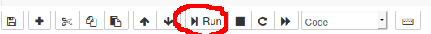

## Instalação
 
### Opção recomendada (em Windows)

Instalar o [Anaconda](https://www.anaconda.com/distribution/).

### Opção alternativa 

Para quem tem o Python instalado e o pip:

```
pip install jupyter
```

Em Linux, se coexistir o Python 2 e Python 3, fazer:

```
sudo pip3 install jupyter
```

### Correr o Jupyter sem instalar nada

Há vários sites que disponibilizam o Jupyter online. Escolha "Try Classic Notebook" a partir do endereço: https://jupyter.org/try

## Executar (preparação)

Para trabalhar num notebook, é preciso por a correr o *servidor de notebooks* com:
```
jupyter notebook
```

O servidor fica a correr, dando a indicação do URL que deve ser usado para se ligar ao servidor. O endereço pré-definido algo como:
http://localhost:8888/?token=57b895db2c2294fd9a98d66253849a47106240a3831ab785

Em princípio, o navegador abre automaticamente já neste endereço, assim que se lança do servidor.

## Dashboard

Abrindo o navegador no endereço anterior, entra-se diretamente no dashboard. O dashboard apresenta todos os seus notebooks, arquivos e pastas.

Quando se entra pela primeira vez, ainda não existem notebooks.

### Primeiro notebook

Vamos criar o primeiro notebook, a partir do menu New → Python 3.


#### Células

Há dois tipos de células num notebook:
-  Células de texto (no formato Markdown)
-  Células de código (Python)

##### Caixa de texto Markdown

Vamos escrever simplesmente "Primeiro notebook" na caixa de texto apresentada. Depois, no menu **Cell**, vamos indicar que é uma caixa de texto, como ilustrado na imagem seguinte.


Depois vamos clicar em "Run".



A célula é visualizada como texto normal e é criada uma nova célula abaixo, como ilustrado.


##### Código Python

De seguida, vamos escrever na segunda caixa de texto o seguinte código Python:
```
print("Bom dia!")
```
Carregue novamente em **Run**.

O código Python é executado e o resultado aparece debaixo da célula.

É criado uma nova célula vazia, como ilustrado na imagem seguinte.


#### Markdown 

Vamos voltar à primeira célula. Em vez de escrever apenas:
```
Primeiro notebook
```
escrevemos:
```
# Primeiro notebook
```
e carregamos em **Run**.

O `#` que acrescentámos serve para criar um título em Markdown. 


#### Gravar o notebook

Eliminamos a última (a terceira célula em branco).

Clique sobre o nome do notebook (que se deve chamar `Untitled`) e altere para `Primeiro notebook`.

Está criado o nosso primeiro notebook. O mesmo fica gravado como `Primeiro notebook.ipynb`.


## Epílogo

Se conseguiu por o Jupyter a correr e conseguiu escrever o seu primeiro notebook, parabéns!

Todo este processo de preparação é complicado. A partir de agora, se tudo ficou bem instalado, é bem mais fácil.

Se não conseguiu instalar o Jupyter, faça um pequeno exemplo usando um [notebook online](https://jupyter.org/try). Depois, com calma, tente instalar o Jupyter no seu computador.

